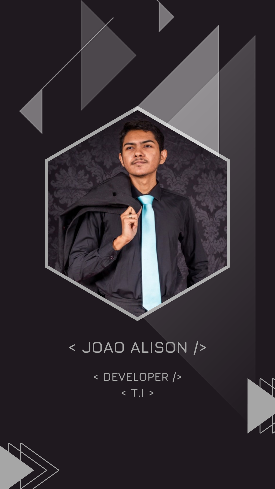

&nbsp;
<h1 align="left">Hi 👋🏽, I'm João Alison</h1>

  

- 🚀 Estou sempre interessado em melhorar, buscar novos conhecimentos, experiências e conquistar meus objetivos.

- 🧑🏾‍💻 Sou amante da programação e da tecnologia.

- 🏫 Concluí o Ensino Médio Técnico em 2022 no curso Técnico em Informática (3 anos), e tenho interesse de ingressar em uma Faculdade e seguir carreira na área de TI.

- 🔭 I’m currently working on **HTML5, CSS3, JavaScript, PHP, SQL and React and Node.js in process**

- 📚 I’m currently learning about **development, programming, techniques, tools.**

  

## 📫 &nbsp;Contact

&nbsp;&nbsp;&nbsp;&nbsp;

  

## 🛠️ &nbsp;Tech Stack

 
&nbsp;
&nbsp;
&nbsp;
&nbsp;
&nbsp;
 

 
&nbsp;
&nbsp;

  

## 📊  &nbsp;GitHub Analytics

